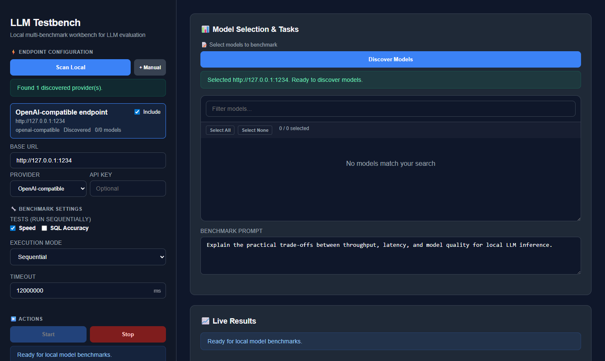
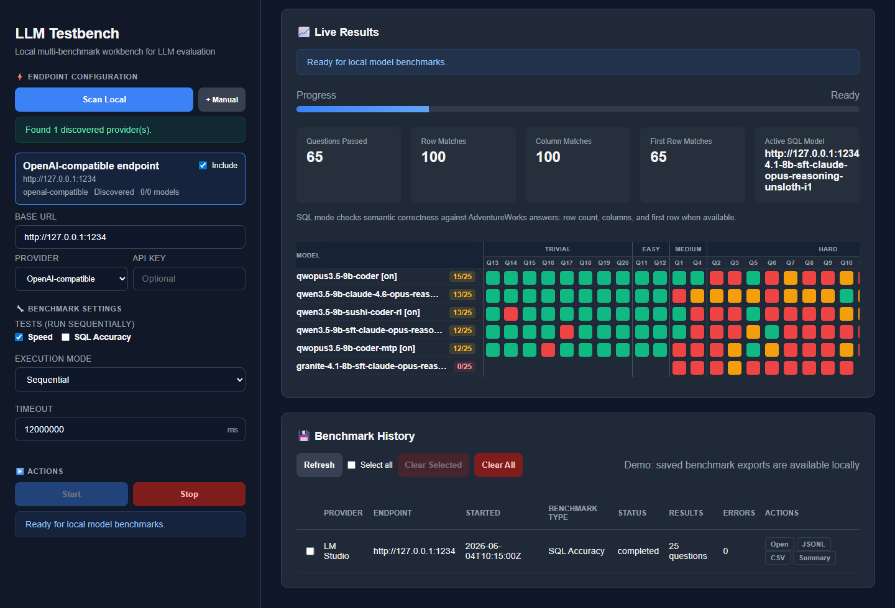

<div align="center">

# LLM Testbench

**Local multi-benchmark workbench for LLM evaluation**

[](https://github.com/bashrusakh/llm-testbench/releases)
[](https://www.python.org/)
[](https://github.com/bashrusakh/llm-testbench)
[](https://github.com/bashrusakh/llm-testbench)
[](https://github.com/bashrusakh/llm-testbench)



*Endpoint configuration · Model discovery · Benchmark selection*

</div>

---

Compare local LLMs on speed and SQL accuracy, with lightweight local fixture packs for future coding and instruction checks — no cloud, no containers, no dataset downloads. Point it at any OpenAI-compatible server and get results in seconds.

## Contents

- [Features](#features)
- [Benchmarks](#benchmarks)
- [Quick Start](#quick-start)
- [Screenshots](#screenshots)
- [Workflow](#workflow)
- [Speed Metrics](#speed-metrics)
- [SQL Accuracy](#sql-accuracy)
- [API](#api)
- [Repository Layout](#repository-layout)
- [Development](#development)

---

## Features

| | |
|---|---|
| ⚡ **Speed** | TTFT, total time, prompt tokens, completion tokens, decode TPS |
| 🗄️ **SQL Accuracy** | DuckDB execution against local AdventureWorks fixtures, tool-call and grammar modes |
| 📦 **Coding & Schema** | Tiny Python coding tasks and JSON schema instruction-following fixtures |
| 📼 **Prompt Replay** | Fixed prompts for fast local regressions — required / optional / forbidden checks |
| 💾 **Exports** | JSONL, CSV, TSV, summary JSON, manifest JSON, dashboard aggregate |
| 🔌 **Endpoints** | LM Studio, llama.cpp, Ollama, and any OpenAI-compatible server |

---

## Benchmarks

| Module | Status | What it measures |
|---|---|---|
| **Speed** | ✅ Startable | TTFT, total time, prompt/completion tokens, prefill TPS, decode TPS |
| **SQL Accuracy** | ✅ Startable | SQL generation correctness against local DuckDB fixtures |
| **Coding Micro** | 🔶 Fixture-ready | Python coding tasks with syntax and static checks |
| **JSON Schema** | 🔶 Fixture-ready | Instruction following scored by JSON parsing and schema-lite checks |
| **Prompt Replay** | 🔶 Fixture-ready | Fixed prompts for fast local regression comparisons |

Fixture-ready modules are wired to the metadata and validation endpoints and can be connected to live generation without changing their fixture format.

---

## Quick Start

**Windows:**
```bat
run.bat
```

**Linux / macOS:**
```bash
./run.sh
```

The launcher creates a virtual environment, installs `python/requirements.txt`, starts the backend, and opens:

```
http://127.0.0.1:8765/
```

Optional flags:
```bash
./run.sh --host 127.0.0.1 --port 8765 --log-level INFO
```
```bat
run.bat --host 127.0.0.1 --port 8765 --log-level INFO
```

---

## Screenshots

### SQL Accuracy — Live Results



*Per-question pass/fail grid across TRIVIAL → EASY → MEDIUM → HARD.*

### History & Exports


*Saved runs with one-click JSONL, CSV, TSV, Manifest, and Summary JSON exports.*

---

## Workflow

1. Start a local inference server — LM Studio, llama.cpp, Ollama, or any OpenAI-compatible endpoint.
2. Open LLM Testbench at `http://127.0.0.1:8765/`.
3. **Scan Local** to auto-discover endpoints, or **+ Manual** to enter a base URL.
4. Click **Discover Models** and select the models to benchmark.
5. Choose benchmark modules and execution mode (sequential / parallel).
6. Hit **Start** and watch live results stream in.
7. Export saved runs from the history panel — JSONL, CSV, TSV, or Summary.

---

## Speed Metrics

The live speed path runs through `BenchmarkServer._run_single_benchmark`. `SpeedAdapter` is metadata-only and raises instead of returning a placeholder, so it cannot silently report phantom passes.

**OpenAI-compatible** — decode TPS is calculated from streamed completion tokens over post-first-token stream time.

**Ollama** — decode TPS uses `eval_count / eval_duration`, excluding model load and prompt evaluation time.

Use `warmup_runs > 0` to keep cold model-loading time out of measured runs.

---

## SQL Accuracy

Supports tool-calling and grammar-style SQL generation modes. Additional controls:

- **Thinking mode** — off, on, or both
- **Reasoning effort** — provider default, none, minimal, low, medium, high, xhigh
- **Per-question timeout** and stop/reload recovery
- **Mismatch details** — row count, columns, first row, generated SQL

`Provider default (omit)` does not send a reasoning field. `none` sends an explicit request to disable reasoning. Servers that reject unknown reasoning fields get an automatic retry without it.

---

## API

```
GET /api/benchmark/contract
GET /api/benchmark/modules
GET /api/benchmark/modules/{module_id}
GET /api/benchmark/modules/{module_id}/adapter
GET /api/benchmark/presets
GET /api/benchmark/presets/{preset_id}
GET /api/benchmark/dashboard
GET /api/fixtures
GET /api/fixtures/validate
```

Saved run exports:

```
GET /api/benchmark/{job_id}/results.jsonl
GET /api/benchmark/{job_id}/results.csv
GET /api/benchmark/{job_id}/results.tsv
GET /api/benchmark/{job_id}/summary.json
GET /api/benchmark/{job_id}/manifest.json
GET /api/benchmark/summaries
```

---

## Repository Layout

```
llm-testbench/
├── index.html                  # Single-page browser UI
├── run.bat / run.sh            # Cross-platform launchers
├── python/
│   ├── server.py               # Backend API and benchmark orchestration
│   ├── adapter.py              # Benchmark adapter ABC + Speed / SQL adapters
│   ├── sql_benchmark.py        # SQL benchmark runner
│   └── local_benchmarks.py     # Local fixture loaders, validators, and scorers
├── sql_benchmark_data/         # SQL questions and AdventureWorks tables
├── coding_data/                # Tiny Python coding tasks
├── json_schema_data/           # JSON instruction-following tasks
├── prompt_replay_data/         # Fixed regression prompts
├── docs/screenshots/           # README screenshots
└── tests/                      # Backend, adapter, fixture, dashboard, and frontend tests
```

---

## Development

Install dependencies:

```bash
python -m pip install -r python/requirements.txt pytest
```

Run the test suite (115 tests):

```bash
python -m pytest tests -q
```

Run the backend directly:

```bash
python -m python.server
```

---

## Scope

**In scope** — local model endpoints, small repository-owned fixtures, deterministic local tests, simple adapter and API contracts, fast smoke and comparison runs.

**Out of scope** — Terminal-Bench; SWE-bench / SWE-rebench / Multi-SWE-bench / SWE-agent / OpenHands / SWE-ReX; WebArena / OSWorld / CodeClash / GAIA / tau-bench; LiveCodeBench and BigCodeBench as external integrations; Docker orchestration, browser farms, desktop VMs, remote services, large downloaded benchmark datasets.
